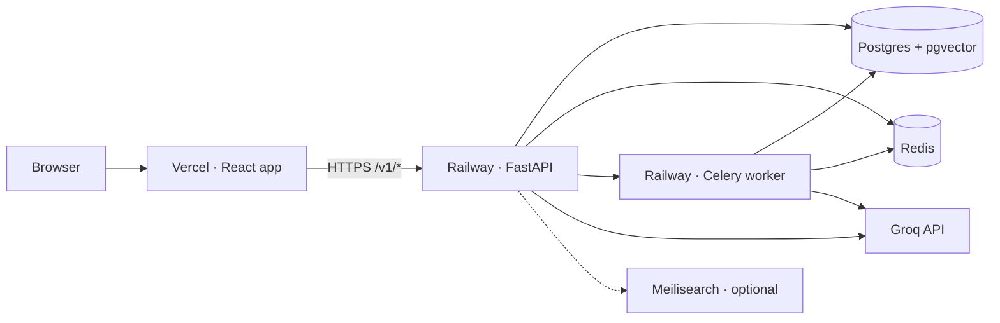

# Deployment Plan — Railway + Vercel

> Step-by-step guide to deploy **USL Blinkit** to production.  
> **Frontend:** Vercel · **Backend:** Railway (API + worker + Postgres + Redis)

---

## 1. Overview

| Component | Platform | Repo path | Config |
| --- | --- | --- | --- |
| React + Vite UI | **Vercel** | `frontend/` | `frontend/vercel.json` |
| FastAPI API | **Railway** | `backend/` | `railway.toml`, `backend/Dockerfile` |
| Celery intent worker | **Railway** (2nd service) | `backend/` | Same image, different start command |
| PostgreSQL + pgvector | **Railway** plugin | — | `DATABASE_URL` |
| Redis | **Railway** plugin | — | `REDIS_URL` |
| Meilisearch | Optional (Railway template / Meilisearch Cloud) | — | `MEILI_URL` |
| LLM | Groq (external) | — | `GROQ_API_KEY` |



**Traffic flow**

1. User opens the Vercel URL (SPA).
2. Frontend calls `VITE_API_URL` (Railway API) with `Authorization: Bearer <token>`.
3. API reads/writes Postgres; enqueues Path A jobs to Redis for the Celery worker.
4. Checkout recommendations (Path B) run synchronously on the API unless cached in Redis.

---

## 2. Prerequisites

- [GitHub](https://github.com) repository with this codebase pushed to `main`.
- [Railway](https://railway.app) account (GitHub login).
- [Vercel](https://vercel.com) account (GitHub login).
- [Groq](https://console.groq.com) API key for LLM features.
- Domain names (optional): custom domain on Vercel + Railway.

**Local verification before deploy**

```bash
docker compose up -d          # Postgres, Redis, Meilisearch
cd backend && alembic upgrade head && python scripts/seed_catalog.py
uvicorn app.main:app --reload # API on :8000
celery -A app.worker.celery_app worker -Q usl-intent -l info  # optional Path A
cd frontend && npm run build  # ensure production build passes
```

---

## 3. Railway — Backend

### 3.1 Create project

1. Go to [Railway Dashboard](https://railway.app/dashboard) → **New Project**.
2. Choose **Deploy from GitHub repo** and select `USL-Blinkit`.
3. Railway detects `railway.toml` at the repo root and builds with `backend/Dockerfile`.

> **Important:** The Dockerfile expects the **repository root** as build context (`COPY backend/...`). Do not change the root directory to `backend/` only, or the Docker build will fail.

### 3.2 Add PostgreSQL (pgvector)

1. In the project, click **+ New** → **Database** → **PostgreSQL**.
2. After provisioning, open the Postgres service → **Variables** → copy `DATABASE_URL` (or reference it from the API service).
3. **pgvector:** Migration `001_initial_schema` runs `CREATE EXTENSION IF NOT EXISTS vector`. Railway’s default Postgres image supports extensions on most plans; if migration fails, use a [pgvector-enabled Postgres template](https://railway.com/template) or self-host `pgvector/pgvector:pg16`.

### 3.3 Add Redis

1. **+ New** → **Database** → **Redis**.
2. Reference `REDIS_URL` from the API and worker services.

### 3.4 API service (web)

Use the GitHub-linked service created from `railway.toml`:

| Setting | Value |
| --- | --- |
| Builder | Dockerfile (`backend/Dockerfile`) |
| Start command | `uvicorn app.main:app --host 0.0.0.0 --port $PORT` (from `railway.toml`) |
| Health check | `GET /health` |
| Root directory | Repository root (default) |

**Generate a public URL:** Service → **Settings** → **Networking** → **Generate Domain** (e.g. `usl-api-production.up.railway.app`).

### 3.5 Celery worker (second service)

Path A intent processing requires a background worker in production (`INTENT_WORKER_SYNC=false`).

1. **+ New** → **GitHub Repo** → same repository (or **Duplicate** the API service).
2. Use the **same Dockerfile** / build settings as the API.
3. Override **Start command**:

```bash
/app/start-worker.sh
```

Or with custom concurrency: `CELERY_CONCURRENCY=2` (default).

4. Attach the **same** `DATABASE_URL`, `REDIS_URL`, and Groq/env vars as the API service (Railway **Shared Variables** or reference syntax `${{Postgres.DATABASE_URL}}`).
5. No public domain needed for the worker.

### 3.6 Meilisearch (optional)

Catalog search uses Meilisearch locally via Docker. For production, pick one:

| Option | Notes |
| --- | --- |
| **Meilisearch Cloud** | Managed; set `MEILI_URL` + `MEILI_MASTER_KEY` |
| **Railway template** | Deploy Meilisearch as another service |
| **Disable** | Set `MEILI_ENABLED=false` — API falls back to SQL `ILIKE` search |

After deploy, run catalog seed (see §3.8) to index products.

### 3.7 Environment variables (Railway)

Set these on **both API and worker** services unless noted.

| Variable | Required | Example / notes |
| --- | --- | --- |
| `DATABASE_URL` | Yes | `${{Postgres.DATABASE_URL}}` |
| `REDIS_URL` | Yes | `${{Redis.REDIS_URL}}` |
| `GROQ_API_KEY` | Yes (for LLM) | `gsk_...` |
| `GROQ_MODEL` | No | `llama-3.3-70b-versatile` |
| `GROQ_FALLBACK_MODEL` | No | `mixtral-8x7b-32768` |
| `JWT_SECRET` | Yes | Strong random string (production) |
| `CORS_ORIGINS` | Yes | `https://your-app.vercel.app` (comma-separated if multiple) |
| `USL_ENABLED` | No | `true` |
| `USL_CHECKOUT_RECOMMENDATIONS` | No | `true` |
| `INTENT_WORKER_SYNC` | No | **`false`** in production |
| `ADMIN_DEBUG_ENABLED` | No | **`false`** in production |
| `EMBEDDINGS_ENABLED` | No | `true` (requires worker memory for model) |
| `EMBEDDING_MODEL` | No | `sentence-transformers/all-MiniLM-L6-v2` |
| `MEILI_URL` | If using Meili | `https://...` |
| `MEILI_MASTER_KEY` | If using Meili | Master key |
| `MEILI_ENABLED` | No | `true` / `false` |
| `ENVIRONMENT` | No | `production` |

Reference variables in Railway: **Variables** tab → **Add Reference** → select Postgres/Redis service.

### 3.8 Database migrations & seed (one-time / per release)

Run after Postgres is linked and before smoke-testing the API.

**Option A — Startup flags (first deploy)**

On the Railway API service, set temporarily:

```bash
RUN_MIGRATIONS_ON_STARTUP=true
SEED_CATALOG_ON_STARTUP=true
```

Redeploy once; the [`backend/docker-entrypoint.sh`](../backend/docker-entrypoint.sh) runs Alembic + seed before Uvicorn. Set both back to `false` after the first successful deploy.

**Option B — Railway CLI (recommended for later releases)**

```bash
npm i -g @railway/cli
railway login
railway link          # select project + API service
railway run alembic upgrade head
railway run python scripts/seed_catalog.py
```

**Option C — One-off start command override**

Temporarily set API start command to:

```bash
alembic upgrade head && python scripts/seed_catalog.py && /app/docker-entrypoint.sh
```

### 3.9 Verify Railway API

```bash
curl https://<your-railway-domain>/health
curl https://<your-railway-domain>/v1/flags
curl -H "Authorization: Bearer dev" https://<your-railway-domain>/v1/users/location
```

Docs: `https://<your-railway-domain>/docs`

---

## 4. Vercel — Frontend

### 4.1 Import project

1. [Vercel Dashboard](https://vercel.com/dashboard) → **Add New** → **Project**.
2. Import the same GitHub repository.
3. Configure:

| Setting | Value |
| --- | --- |
| **Framework Preset** | Vite |
| **Root Directory** | `frontend` |
| **Build Command** | `npm run build` (default) |
| **Output Directory** | `dist` |
| **Install Command** | `npm install` |

`frontend/vercel.json` already defines SPA rewrites (`/(.*)` → `/index.html`).

### 4.2 Environment variables (Vercel)

Set in **Project → Settings → Environment Variables** for **Production** (and Preview if desired):

| Variable | Required | Example |
| --- | --- | --- |
| `VITE_API_URL` | Yes | `https://usl-api-production.up.railway.app` |
| `VITE_ADMIN_DEBUG` | No | `false` in production |

> Vite embeds `VITE_*` at **build time**. After changing `VITE_API_URL`, trigger a **Redeploy**.

### 4.3 CORS on Railway

After Vercel assigns a URL (e.g. `https://usl-blinkit.vercel.app`), update Railway API:

```bash
CORS_ORIGINS=https://usl-blinkit.vercel.app,https://usl-blinkit-*.vercel.app
```

Include preview URLs if you test PR deployments. Redeploy the API if CORS was wrong on first deploy.

### 4.4 Custom domain (optional)

1. Vercel → **Domains** → add `app.yourdomain.com`.
2. Add the custom origin to Railway `CORS_ORIGINS`.
3. Optionally add a CNAME for the API (e.g. `api.yourdomain.com` → Railway) and set `VITE_API_URL` accordingly.

### 4.5 Verify frontend

1. Open the Vercel URL.
2. Complete welcome → location → add a USL item → shop → checkout.
3. Browser DevTools → Network: API calls should go to `VITE_API_URL`, not `localhost`.
4. No CORS errors in the console.

---

## 5. End-to-end deploy checklist

### Railway

- [ ] Project created from GitHub
- [ ] Postgres provisioned; `DATABASE_URL` referenced
- [ ] Redis provisioned; `REDIS_URL` referenced
- [ ] API service deployed; public domain generated
- [ ] Celery worker service deployed (same env, worker start command)
- [ ] `GROQ_API_KEY`, `JWT_SECRET`, `CORS_ORIGINS` set
- [ ] `INTENT_WORKER_SYNC=false`, `ADMIN_DEBUG_ENABLED=false`
- [ ] `alembic upgrade head` + `seed_catalog.py` executed
- [ ] `/health` returns `200`

### Vercel

- [ ] Root directory = `frontend`
- [ ] `VITE_API_URL` = Railway public URL
- [ ] Production build succeeds
- [ ] SPA routes work (refresh on `/` does not 404)
- [ ] App loads and calls live API

### Integration

- [ ] CORS allows Vercel origin(s)
- [ ] USL create item → worker processes match (check Railway worker logs)
- [ ] Checkout recommendations return when `USL_CHECKOUT_RECOMMENDATIONS=true`
- [ ] Groq smoke: `POST /v1/integrations/groq/smoke` (optional)

---

## 6. CI/CD (optional)

### GitHub → Railway

- Enable **Auto Deploy** on push to `main` for API and worker services.
- Run migrations in a GitHub Action before/after deploy, or use Railway **Pre-deploy** hook:

```yaml
# .github/workflows/deploy-railway.yml (example)
- run: railway run alembic upgrade head
```

### GitHub → Vercel

- Default: every push to `main` deploys production; PRs get preview URLs.
- Ensure preview deployments use a staging `VITE_API_URL` or the same Railway API with preview CORS origins.

---

## 7. Production hardening

| Topic | Recommendation |
| --- | --- |
| **Secrets** | Never commit `.env`. Use Railway/Vercel secret stores only. |
| **Auth** | Replace dev bearer token with real JWT validation before public launch. |
| **Admin debug** | `ADMIN_DEBUG_ENABLED=false`, `VITE_ADMIN_DEBUG=false` |
| **Worker scale** | Increase Celery `--concurrency` or replica count under load |
| **Postgres** | Enable backups on Railway; monitor connection limits |
| **Redis** | Required for Celery + checkout cache; size plan for peak QPS |
| **Groq** | Monitor rate limits; template fallback works when key missing |
| **Embeddings** | `sentence-transformers` adds image size/RAM; consider disabling (`EMBEDDINGS_ENABLED=false`) on small Railway plans |

---

## 8. Troubleshooting

| Symptom | Likely cause | Fix |
| --- | --- | --- |
| CORS error in browser | `CORS_ORIGINS` missing Vercel URL | Add exact origin(s) on Railway API |
| Frontend calls `localhost` | `VITE_API_URL` not set at build | Set in Vercel env + redeploy |
| `CREATE EXTENSION vector` fails | Postgres without pgvector | Use pgvector-enabled Postgres |
| USL items stuck on `queued` | Worker not running / no Redis | Deploy Celery service; check `REDIS_URL` |
| 502 on Railway | Crash on boot | Check logs; verify `DATABASE_URL`, migrations |
| Empty catalog / search | Seed not run | `railway run python scripts/seed_catalog.py` |
| Checkout recs empty | Flag off or no matches | `USL_CHECKOUT_RECOMMENDATIONS=true`; add matched USL items |
| Docker build fails | Wrong root directory | Build from repo root; use `backend/Dockerfile` |

---

## 9. Related docs

- [Architecture — Deployment Topology](architecture.md#16-deployment-topology)
- [Implementation Plan](implementation-plan.md)
- [README — Quick start](../README.md)
- Railway config: [`railway.toml`](../railway.toml)
- Frontend config: [`frontend/vercel.json`](../frontend/vercel.json)
- Env reference: [`.env.example`](../.env.example)

---

## 10. Quick reference — URLs after deploy

| Resource | URL pattern |
| --- | --- |
| Frontend | `https://<project>.vercel.app` |
| API | `https://<service>.up.railway.app` |
| API docs | `https://<service>.up.railway.app/docs` |
| Health | `https://<service>.up.railway.app/health` |

Replace placeholders with your generated Railway/Vercel domains after first deploy.
