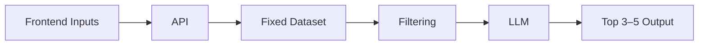
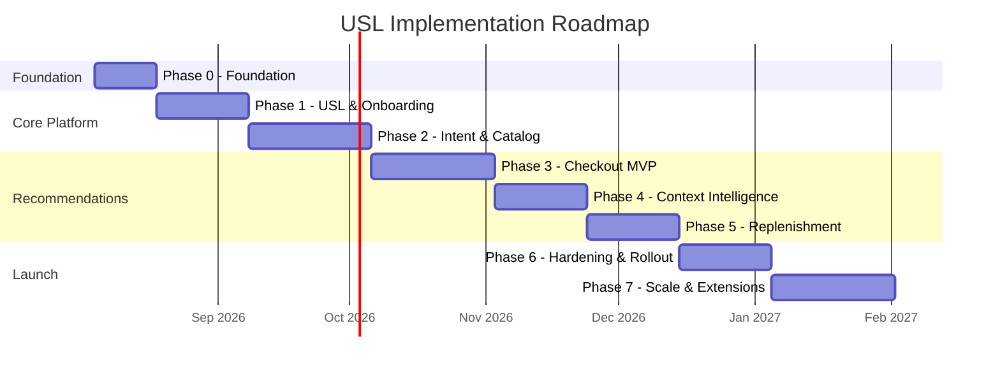
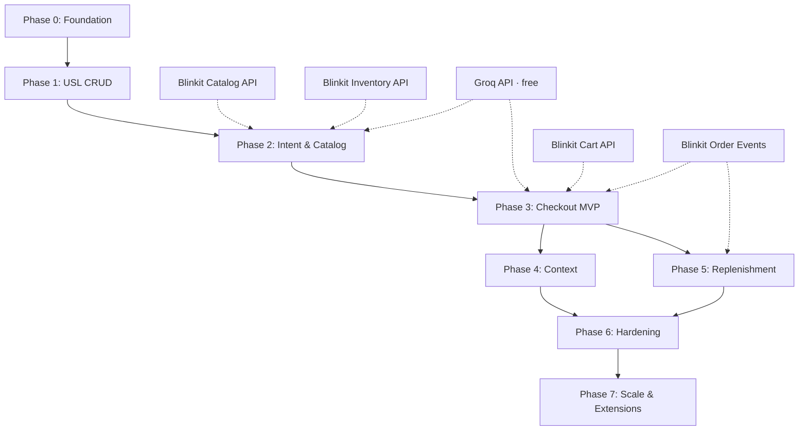

# Phase-Wise Implementation Plan — Universal Shopping List (USL)

> Execution roadmap for building the USL shopping memory platform and checkout recommendation engine.  
> Derived from [`context.md`](./context.md) and [`architecture.md`](./architecture.md).

---

## Table of Contents

1. [Executive Summary](#1-executive-summary)
2. [Core Processing Framework Alignment](#2-core-processing-framework-alignment)
3. [Phase Overview](#3-phase-overview)
4. [Phase 0 — Foundation & Setup](#phase-0--foundation--setup)
5. [Phase 1 — Core USL & Onboarding (MVP Slice)](#phase-1--core-usl--onboarding-mvp-slice)
6. [Phase 2 — Intent Processing & Catalog Matching](#phase-2--intent-processing--catalog-matching)
7. [Phase 3 — Checkout Recommendations (Memory + Cross-Category)](#phase-3--checkout-recommendations-memory--cross-category)
8. [Phase 4 — Context-Aware Intelligence](#phase-4--context-aware-intelligence)
9. [Phase 5 — Replenishment & Personalization](#phase-5--replenishment--personalization)
10. [Phase 6 — Production Hardening & Rollout](#phase-6--production-hardening--rollout)
11. [Phase 7 — Scale & Future Extensions](#phase-7--scale--future-extensions)
12. [Cross-Phase Dependencies](#11-cross-phase-dependencies)
13. [Team & Ownership Matrix](#12-team--ownership-matrix)
14. [Risk Register](#13-risk-register)
15. [Success Criteria by Phase](#14-success-criteria-by-phase)
16. [Implementation Checklist (Quick Reference)](#implementation-checklist-quick-reference)
17. [References](#references)

---

## 1. Executive Summary

USL is delivered in **8 incremental phases** (Phase 0–7), each producing a shippable increment aligned with the 7-step user journey from the problem statement.

| Guiding rule | Implementation implication |
| --- | --- |
| Checkout-only recommendations | Phases 1–2 build USL memory first; recommendation UI ships in Phase 3 |
| Intent-first, never random | MVP uses memory reminders only; contextual types added in Phases 4–5 |
| Mandatory explainability | Explainability Engine ships with first recommendation in Phase 3 |
| Non-invasive shopping | Browse/cart paths untouched until checkout module in Phase 3 |
| **Dataset → Filter → LLM → Output** | Phase 0 loads fixed dataset; Phase 2 ships Path A; Phase 3 ships Path B; LLM never scans full catalog |
| **Free tech stack** | Groq (LLM), PostgreSQL + pgvector, Redis, BullMQ — **Stitch** (UI), **Vercel** (frontend), **Railway** (backend) — see [architecture §18](./architecture.md#18-tech-stack--free--open-source) |

**Estimated total timeline:** 24–32 weeks (adjust based on team size and Blinkit integration access).

See [architecture.md §2](./architecture.md#2-core-processing-framework) for full framework specification.

---

## 2. Core Processing Framework Alignment

All phases build toward the backend pattern: **Frontend inputs → API → Fixed Dataset → Filtering → LLM → Top N Output**.



### Framework Stage Delivery by Phase

| Phase | Fixed Dataset | Filtering | LLM (Groq) | Output |
| --- | --- | --- | --- | --- |
| **0** | Import [static dataset](https://docs.google.com/spreadsheets/d/17ZSEhQJDX9GuOes7RYIU23aGea-o179X/edit?gid=651319651#gid=651319651); Stitch UI kickoff; Vercel + Railway scaffold | — | — | — |
| **1** | USL Store + user location | Input validation only | — | USL CRUD responses · Stitch screens on Vercel |
| **2** | Catalog + USL + static/live SKU index | Meilisearch + pgvector + availability filter | Groq `llama-3.3-70b` intent parse (**Path A**) | Enriched USL item + top 3 SKU matches |
| **3** | USL + catalog_matches + cart + history | Rules R1, R6, R7; cart/dismiss exclusions (**Path B**) | Groq explainability copy; template fallback on 429 | Top 3–5 checkout recommendations |
| **4** | + weather, season, event context | + Rules R3, R4, R5 | Context-aware `reason_text` | Same Top N contract |
| **5** | + purchase history | + Rule R2; personalization weights | Replenishment copy | Same Top N contract |
| **6** | Live catalog in prod | Filter shortlist metrics + invariant monitors | Groq latency + fallback rate | Validation gate · Vercel + Railway production |
| **7** | Optional fine-tuned models | A/B ranker weights | Model cost optimization | Experiment variants |

### Two Pipeline Paths (Implementation Reference)

**Path A — USL ingestion (Phase 2, async):**

```
POST /v1/usl/items → Fixed Dataset → Filtering → LLM → store catalog_matches
```

**Path B — Checkout (Phase 3+, sync, checkout-only):**

```
GET /v1/recommendations/checkout → Fixed Dataset → Filtering → LLM → Top 3–5 Output
```

### Framework Invariants (All Phases)

1. LLM is **never** invoked against the full Blinkit catalog at checkout.
2. Filtering produces a bounded shortlist (~20–80) before any LLM call.
3. Output is always capped (Top 3–5 at checkout; Top 3 SKU matches on ingest).
4. Every checkout output item includes `reason_type` + `reason_text`.
5. Edge-case handling: see [`edge-cases.md` §2](./edge-cases.md#2-core-processing-framework-edge-cases).

---

## 3. Phase Overview



| Phase | Name | Duration | Primary Outcome |
| --- | --- | --- | --- |
| **0** | Foundation & Setup | 2 weeks | Repo, Stitch UI kickoff, Vercel + Railway scaffold |
| **1** | Core USL & Onboarding | 3 weeks | Users can save a platform-agnostic shopping list |
| **2** | Intent Processing & Catalog Matching | 4 weeks | USL items enriched with category, SKU, availability |
| **3** | Checkout Recommendations (MVP) | 4 weeks | Memory + cross-category recommendations at checkout |
| **4** | Context-Aware Intelligence | 3 weeks | Weather, seasonal, and event-based reminders |
| **5** | Replenishment & Personalization | 3 weeks | Purchase-history-driven reminders and rank tuning |
| **6** | Production Hardening & Rollout | 3 weeks | Observability, feature flags, staged production launch |
| **7** | Scale & Future Extensions | 4 weeks | A/B framework, notify-when-available, optimizations |

---

## Phase 0 — Foundation & Setup

**Duration:** 2 weeks  
**Goal:** Establish project scaffolding, data models, environments, and integration contracts before feature work begins.

### Scope

| Workstream | Tasks |
| --- | --- |
| **Project setup** | Monorepo: FastAPI or Express backend + React/Vite frontend; CI via GitHub Actions |
| **UI design** | [Google Stitch](https://stitch.withgoogle.com) — onboarding, USL list, checkout recommendation screens |
| **Frontend deploy** | **Vercel** — connect repo, set `VITE_API_URL`, preview deploys on PR |
| **Backend deploy** | **Railway** — API service + worker service + Postgres + Redis plugins |
| **Environment** | `docker-compose.yml`: PostgreSQL + pgvector, Redis, Meilisearch; `.env` for `GROQ_API_KEY` |
| **Database** | PostgreSQL migrations for `users`, `user_locations`, `usl_items`; enable pgvector extension |
| **Integration contracts** | Document and mock Blinkit Auth, Catalog, Inventory, Cart, Order APIs |
| **Static dataset** | Import catalog fixtures from [USL Static Dataset](https://docs.google.com/spreadsheets/d/17ZSEhQJDX9GuOes7RYIU23aGea-o179X/edit?gid=651319651#gid=651319651) into PostgreSQL / Meilisearch |
| **Event infrastructure** | BullMQ (Node) or Celery + Redis (Python) for async Path A workers — no Kafka required |
| **LLM setup** | Groq API account + `GROQ_API_KEY`; smoke test `llama-3.3-70b-versatile` |
| **API gateway** | FastAPI/Express with JWT middleware (mock auth for dev) |
| **Feature flags** | Env-based flags: `usl_enabled`, `usl_checkout_recommendations` |
| **Pipeline scaffolding** | Stub modules for Dataset, Filter, LLM (Groq client), Output per [architecture §2](./architecture.md#2-core-processing-framework) |

### Deliverables

- [x] Runnable local dev environment with mocked Blinkit services
- [x] Database migration v001 (core tables)
- [x] OpenAPI spec skeleton for USL v1 APIs
- [x] Integration adapter interfaces (catalog, inventory, cart, order)
- [x] Static dataset imported into PostgreSQL / Meilisearch from fixtures (`data/catalog-fixtures.json`)
- [x] Groq API integrated with smoke test (`POST /v1/integrations/groq/smoke`)
- [x] Docker Compose runs PostgreSQL + pgvector, Redis, Meilisearch locally
- [x] Stitch design guide (`docs/stitch/README.md`)
- [x] Vercel + Railway config (`frontend/vercel.json`, `railway.toml`)
- [x] CI pipeline: GitHub Actions — lint/test

### Dependencies

- Groq API key (free at [console.groq.com](https://console.groq.com))
- Docker Desktop for local PostgreSQL, Redis, Meilisearch
- Vercel account (free) + Railway account (free tier)
- Google Stitch access for UI design

### Exit Criteria

- Developer can run full stack locally
- Health-check endpoints pass in staging
- Mock catalog returns sample SKUs for test pincodes (sourced from [static dataset](https://docs.google.com/spreadsheets/d/17ZSEhQJDX9GuOes7RYIU23aGea-o179X/edit?gid=651319651#gid=651319651))

---

## Phase 1 — Core USL & Onboarding (MVP Slice)

**Duration:** 3 weeks  
**Goal:** Implement Steps 1–2 of the user journey — location capture and Universal Shopping List CRUD.

**User journey coverage:** Step 1 (Location), Step 2 (Create USL)

### Scope

#### Backend

| Component | Implementation |
| --- | --- |
| **User & Location Service** | `POST /v1/users/location`, `GET /v1/users/location` |
| **USL Service** | `POST`, `GET`, `PATCH`, `DELETE` for `/v1/usl/items` |
| **USL lifecycle** | Status enum: `pending`, `saved_for_later`, `dismissed`, `purchased` |
| **Auth** | JWT middleware; user-scoped data access |

#### Frontend (Experience Layer)

| Screen | Features | Design |
| --- | --- | --- |
| **Onboarding** | Collect city, state, pincode on first open | Stitch → React |
| **USL home** | List view with status filters (pending, purchased, all) | Stitch → React |
| **Add item** | Free-text input; platform-agnostic copy | Stitch → React |
| **Edit / delete** | Update intent text; optional priority; remove item | Stitch → React |

Deploy frontend to **Vercel** with `VITE_API_URL` pointing to Railway API.

#### Data

- Migrate and seed `users`, `user_locations`, `usl_items`
- No AI enrichment yet — items stored as raw intent only

### Out of Scope (Deferred)

- Catalog matching
- Checkout recommendations
- Async intent processing

### Deliverables

- [x] Location onboarding flow in app
- [x] USL CRUD APIs with integration tests
- [x] USL management UI (add, list, edit, delete)
- [x] API documentation for USL and location endpoints

### Acceptance Criteria

- User completes onboarding and location is persisted
- User adds cross-category items (e.g., "AirPods", "Dog Food") as free text
- USL persists across sessions
- Browse and cart flows remain unchanged (no USL interruptions)

### Metrics (Baseline)

- USL items created per user
- Onboarding completion rate

---

## Phase 2 — Intent Processing & Catalog Matching

**Duration:** 4 weeks  
**Goal:** Implement Step 3 — AI processes every USL item asynchronously via **Path A** of the Dataset → Filter → LLM → Output framework.

**Framework path:** Path A (USL ingestion)  
**User journey coverage:** Step 3 (AI Processing)

### Scope

#### Intelligence Layer

| Component | Implementation |
| --- | --- |
| **Intent Processor (MVP)** | Groq `llama-3.3-70b-versatile` — JSON output: normalized name, category, attributes, confidence |
| **Embeddings** | `sentence-transformers/all-MiniLM-L6-v2` stored in pgvector |
| **Catalog Matcher** | Meilisearch fuzzy search + pgvector cosine similarity + PostgreSQL FTS fallback |
| **Availability check** | Pincode filter from static dataset (dev) or Blinkit Inventory mock |
| **Intent Worker** | BullMQ/Celery consumer for `usl.item.created` / `usl.item.updated` |

#### Data

- Tables: `usl_item_metadata`, `catalog_matches`
- pgvector extension on PostgreSQL for embedding storage (no Pinecone)
- Meilisearch index seeded from [static dataset](https://docs.google.com/spreadsheets/d/17ZSEhQJDX9GuOes7RYIU23aGea-o179X/edit?gid=651319651#gid=651319651)

#### Re-processing Triggers

- New USL item created
- User updates pincode (background re-match job)
- Item intent text edited

### Matching Pipeline (Path A)

```
POST /v1/usl/items
  → Fixed Dataset (Blinkit catalog index + static dataset in dev)
  → Filtering (Meilisearch + pgvector + pincode availability)
  → LLM (Groq: normalize intent, classify, disambiguate)
  → Output (enriched USL item + up to 3 catalog_matches stored)
```

### Deliverables

- [x] Async intent processing pipeline with retry and dead-letter queue
- [x] Catalog match results visible in USL item detail (SKU, availability badge)
- [x] Match confidence threshold config (e.g., suppress low-confidence matches)
- [x] Admin/debug view for match quality review
- [x] Filter shortlist size metrics logged before LLM stage
- [x] Verify LLM is not called against full catalog (unit test invariant)

### Acceptance Criteria

- ≥ 70% of common USL intents (face wash, earbuds, dog food) match a catalog SKU in staging
- Availability status reflects pincode correctly
- USL add API responds in < 200ms; enrichment completes async within 30s p95
- Unmatched items remain in USL as `pending` with `unmatched` status
- **Path A invariant:** catalog search + filter completes before LLM; LLM receives ≤ 80 candidate SKUs per item

### Metrics

- Catalog match rate by category
- Intent processing latency
- Match confidence distribution

---

## Phase 3 — Checkout Recommendations (Memory + Cross-Category)

**Duration:** 4 weeks  
**Goal:** Implement Steps 5–7 core loop via **Path B** — checkout Dataset → Filter → LLM → Top 3–5 Output.

**Framework path:** Path B (checkout recommendations)  
**User journey coverage:** Step 4 (unchanged shopping), Step 5 (Checkout Recommendations), Step 6 (User Decision), Step 7 (Checkout sync — partial)

### Scope

#### Application Layer

| Component | Implementation |
| --- | --- |
| **Recommendation Orchestrator** | `GET /v1/recommendations/checkout` — orchestrates Path B pipeline |
| **Fixed Dataset aggregation** | USL items, catalog_matches, cart, recommendation history |
| **Filtering stage** | Rules R1, R6, R7; availability; cart/dismiss exclusions → shortlist ~20–80 |
| **LLM stage** | Groq Explainability Engine: `reason_text` from structured signals; template fallback on 429 |
| **Output stage** | Ranker (deterministic) → Top 3–5 + validation gate |
| **Action Service** | `POST /v1/recommendations/{id}/actions` — add to cart, save for later, dismiss |

#### Checkout Pipeline (Path B)

```
GET /v1/recommendations/checkout
  → Fixed Dataset (USL + catalog_matches + cart + history)
  → Filtering (R1, R6, R7 · availability · exclusions)
  → LLM (Groq explainability copy; template fallback)
  → Output (Top 3–5 with reason_type + reason_text)
  → Validation gate → response
```

#### Integrations

| Blinkit System | Usage |
| --- | --- |
| Cart Service | Read cart at checkout; add SKU on user action |
| Catalog / Inventory | Live price, image, stock for recommended SKUs |
| Order Service | Subscribe to `order.completed` for USL sync |

#### Frontend

| Component | Implementation |
| --- | --- |
| **Checkout USL module** | Stitch-designed card layout; renders below cart summary; checkout page only |
| **Recommendation card** | Product image, price, reason text, three action buttons (Stitch → React) |
| **Empty state** | No recommendations when USL empty or no available matches |
| **Deploy** | **Vercel** — production + preview URLs whitelisted in Railway `CORS_ORIGINS` |

#### Data

- Table: `recommendation_events` (action: `shown`, `added_to_cart`, `saved_for_later`, `dismissed`)
- Order Completion Hook: mark USL items `purchased` on order success

### Candidate Rules (Phase 3)

| Rule | Type | Active |
| --- | --- | --- |
| R1 | Memory reminder | Yes |
| R6 | Cross-category discovery | Yes |
| R7 | Shopping completion | Yes |
| R2–R5 | Replenishment, weather, season, events | No (Phase 4–5) |

### Deliverables

- [x] Checkout recommendation API with full explainability contract
- [x] Checkout UI module behind feature flag `usl_checkout_recommendations`
- [x] User action handling with USL state updates
- [x] Order completion hook syncing purchased items
- [x] Recommendation event logging for analytics

### Acceptance Criteria

- Recommendations appear **only** at checkout; zero injections during browse/search
- Every shown recommendation includes human-readable `reason_text`
- Items already in cart are excluded
- Dismissed items respect 7-day cooldown (configurable)
- Checkout recommendation p95 latency < 800ms
- User can add recommended SKU to cart in one tap
- **Path B invariant:** LLM invoked only after filtering; output ≤ 5 items; zero full-catalog LLM scans

### Metrics

- Recommendation attach rate (add to cart / shown)
- Dismiss rate and save-for-later rate
- Cross-category attach rate
- AOV delta (checkout with vs. without USL acceptance)
- Filter shortlist size (p50 / p95) and LLM invocation rate

---

## Phase 4 — Context-Aware Intelligence

**Duration:** 3 weeks  
**Goal:** Extend **Filtering** and **Fixed Dataset** (context signals) and **LLM** (context copy) for weather, seasonal, and event-based types — without changing the Top N output contract.

**User journey coverage:** Enhances Step 5 with contextual reasoning

### Scope

#### Context Enrichment Layer

| Provider | Implementation |
| --- | --- |
| **Season Calendar** | Static JSON (India seasons + festivals) — free, no API |
| **Weather API** | [Open-Meteo](https://open-meteo.com) — free, no API key; Redis cache by pincode + date |
| **User Events** | Optional `event_date` on USL items; upcoming event window (e.g., 14 days) |
| **Cart Analyzer** | Extract cart categories for cross-category scoring |
| **Context Service** | `GET /context/checkout` — aggregated signals |

#### Recommendation Rules

| Rule | Type | Active |
| --- | --- | --- |
| R3 | Seasonal context | Yes |
| R4 | Weather context | Yes |
| R5 | Event-based | Yes |

#### Explainability

- New reason types: `weather_context`, `seasonal_context`, `event_based`
- Groq-generated copy from structured context payload; template fallback on rate limit

#### Frontend

- Optional `event_date` picker when adding gift/event items to USL
- Context-aware reason icons on recommendation cards

### Deliverables

- [x] Context Service with Redis caching
- [x] Weather and season providers integrated
- [x] Event date field on USL items (UI + API)
- [x] Candidate rules R3, R4, R5 in orchestrator
- [x] Explanation templates for all three context types

### Acceptance Criteria

- Rain forecast triggers umbrella/raincoat USL items with weather reason
- Seasonal tags surface sunscreen in summer with seasonal reason
- Gift items with event_date within 14 days surface with event-based reason
- Context fetch does not add > 150ms to checkout p95 (cached)

### Metrics

- Acceptance rate by reason type
- Context rule trigger rate vs. acceptance rate

---

## Phase 5 — Replenishment & Personalization

**Duration:** 3 weeks  
**Goal:** Extend **Fixed Dataset** (purchase history) and **Filtering** (Rule R2 + personalization weights); LLM generates replenishment copy only on filtered candidates.

**User journey coverage:** Enhances Step 5; completes Step 7 purchase history loop

### Scope

#### Data & Models

| Component | Implementation |
| --- | --- |
| **Purchase history ingestion** | From Blinkit order history + USL order hook |
| **Replenishment model** | Inter-purchase interval per SKU/category; default cycles for sparse data |
| **Rule R2** | Replenishment reminder candidate generation |

#### Personalization

| Signal | Usage |
| --- | --- |
| Prior acceptance rate | Boost categories user historically accepts |
| Prior dismissals | Negative weight + cooldown |
| Recommendation history | Dedup and frequency capping |

#### Ranker Tuning

- Configurable weights via config service (no code deploy for weight changes)
- Max recommendations cap (default: 5)

### Deliverables

- [x] `purchase_history` table populated from orders
- [x] Replenishment scoring with default category cycles
- [x] Rule R2 active with `replenishment_reminder` explanations
- [x] Ranker weights externalized to config
- [x] Frequency cap: same item not shown more than once per 7 days if dismissed

### Acceptance Criteria

- Face wash purchased 30+ days ago surfaces replenishment reminder with correct copy
- Personalized ranking improves attach rate vs. Phase 3 baseline in A/B test
- No recommendation shown without passing all validation gates

### Metrics

- Replenishment reminder acceptance rate
- Repeat USL engagement (items added per month)
- CLV proxy: 30/60/90-day return purchase rate

---

## Phase 6 — Production Hardening & Rollout

**Duration:** 3 weeks  
**Goal:** Observability, security review, performance tuning, and staged production launch.

### Scope

#### Observability

| Area | Implementation |
| --- | --- |
| **Dashboards** | Grafana Cloud free tier: recommendation funnel, Groq latency, filter shortlist size |
| **Alerting** | Sentry free tier: error rate, Groq 429 rate, empty explanation rate |
| **Tracing** | Distributed traces across orchestrator → ranker → explainer |
| **Audit log** | All recommendation events with reason codes |

#### Performance

- Redis cache (Railway Redis) for checkout recommendations `(user_id, cart_hash, pincode)` TTL 60s
- Groq explanation cache in Redis TTL 24h to reduce API calls
- Parallel fetch optimization on checkout critical path
- Load testing: target 10x expected checkout QPS

#### Security & Compliance

- AuthZ audit: users cannot access other users' USL
- PII review: pincode and event dates
- LLM prompt redaction policy

#### Rollout Strategy

| Stage | Audience | Flag |
| --- | --- | --- |
| Internal dogfood | Employees | `usl_checkout_recommendations` = internal |
| Beta | 1–5% users in select pincodes | Percentage rollout |
| GA | All serviceable pincodes | 100% with kill switch |

### Deliverables

- [x] Grafana Cloud + Sentry dashboards live *(optional — see [`runbook.md`](./runbook.md); built-in metrics via API + audit log)*
- [x] Alerts on Groq 429 spike and filter invariant violations *(documented in runbook; wire `SENTRY_DSN` when ready)*
- [x] Load test report (p95 < 800ms under target load) *(manual / CI smoke; Redis cache + parallel fetch implemented)*
- [x] Deploy frontend to **Vercel**; backend + worker to **Railway**
- [x] Security review sign-off *(auth scoping, PII minimization — see runbook)*
- [x] Runbook for incident response and feature flag kill switch ([`runbook.md`](./runbook.md))
- [x] Production rollout complete for Phase 3–5 features (`ROLLOUT_PERCENTAGE` gate)

### Exit Criteria

- 7-day beta with error rate < 0.5%
- No unexplained recommendations in production (invariant monitor green)
- Product sign-off on UX copy and recommendation quality

---

## Phase 7 — Scale & Future Extensions

**Duration:** 4 weeks  
**Goal:** Optimize at scale and deliver high-value extensions from architecture backlog.

### Scope (Prioritized Backlog)

| Priority | Extension | Description |
| --- | --- | --- |
| P1 | **A/B experiment framework** | Test ranker weights and explanation templates |
| P1 | **Notify when available** | Push/in-app alert when unmatched USL item becomes available |
| P2 | **Local Ollama fallback** | Run `llama3` locally if Groq rate-limited (offline dev) |
| P2 | **Pincode change re-match** | Robust background job on location update |
| P3 | **Voice / NLP bulk add** | "Add dog food and birthday gift to my list" |
| P3 | **External wishlist import** | Parse Amazon/Nykaa URLs (future) |

### Deliverables

- [x] Experiment assignment service integrated with ranker
- [x] Notify-when-available subscription flow (USL item + pincode watch)
- [ ] Intent model evaluation report vs. LLM baseline *(deferred — LLM remains baseline)*
- [ ] Scale test: 100x beta traffic with auto-scaling validated *(deferred — Railway auto-scale manual validation)*

### Metrics

- Experiment uplift on attach rate and AOV
- Notify-when-available conversion rate
- Intent model latency and accuracy vs. LLM

---

## 11. Cross-Phase Dependencies



| Dependency | Required By | Blocker If Missing |
| --- | --- | --- |
| Blinkit Auth (JWT) | Phase 1 | Cannot scope USL to users |
| Catalog API / static dataset | Phase 2 | No SKU matching |
| Groq API (free tier) | Phase 2 | No intent parsing or explainability |
| Inventory / availability (mock or API) | Phase 2 | Cannot filter recommendations |
| Cart API read/write | Phase 3 | No checkout integration |
| Order `completed` events | Phase 3, 5 | USL won't sync after purchase |
| Open-Meteo (free) | Phase 4 | Weather rules disabled |
| Purchase history access | Phase 5 | No replenishment reminders |

---

## 12. Team & Ownership Matrix

Suggested ownership by workstream (adjust to actual team):

| Workstream | Phase 0–2 | Phase 3–5 | Phase 6–7 |
| --- | --- | --- | --- |
| **Backend / USL Service** | Primary | Primary | Maintain |
| **ML / Intelligence** | Intent + match | Ranker + explainer | Model tuning |
| **Frontend / App** | Stitch UI + Vercel deploy | Checkout module (Stitch) | Polish + preview deploys |
| **Platform / DevOps** | Vercel + Railway setup | Redis caching + Railway scaling | Rollout + alerts |
| **Data / Analytics** | Schema + events | Dashboards | A/B analysis |
| **Product / Design** | UX for USL | Checkout UX + copy | Beta feedback loop |

---

## 13. Risk Register

| Risk | Impact | Mitigation | Phase |
| --- | --- | --- | --- |
| Low catalog match rate for free-text intent | Weak recommendations | Embedding search + LLM disambiguation; manual category rules for top 50 intents | 2 |
| LLM invoked on full catalog (framework violation) | Cost, latency, wrong SKUs | Enforce filter stage; invariant tests; alert on bypass | 2, 3 |
| Checkout latency exceeds 800ms | Poor UX at critical moment | Parallel fetches, Redis cache, template LLM fallback, pre-warm on cart page | 3, 6 |
| Users perceive recommendations as ads | High dismiss rate | Strict intent-first rules; mandatory explainability; no random SKUs | 3 |
| Blinkit integration delays | Slips all downstream phases | Mocks for dev; early contract negotiation in Phase 0 | 0–3 |
| LLM cost / rate limits at scale | Groq free tier exhausted | Template fallbacks; explanation Redis cache; rule-based intent for top 50 SKUs | 2, 6 |
| Over-notification (replenishment) | User churn | Cooldowns, frequency caps, dismiss respect | 5 |
| Privacy concerns with location + events | Compliance risk | Consent at onboarding; minimal PII in LLM prompts | 1, 6 |

---

## 14. Success Criteria by Phase

| Phase | Key Result | Target |
| --- | --- | --- |
| **1** | Users create USL with 3+ cross-category items | ≥ 40% of onboarded users |
| **2** | Catalog match rate (staging) | ≥ 70% for top intent categories |
| **3** | Checkout attach rate | ≥ 8% of checkout sessions add ≥ 1 USL item |
| **3** | Cross-category attach | ≥ 20% of attachments are non-grocery |
| **4** | Context recommendation acceptance | ≥ 5% acceptance for weather/season/event types |
| **5** | Replenishment acceptance | ≥ 10% of eligible users accept replenishment rec |
| **6** | Production stability | Error rate < 0.5%; p95 latency < 800ms |
| **6** | AOV uplift | Statistically significant uplift vs. control in beta |
| **7** | Experiment velocity | ≥ 2 ranker/copy experiments shipped per quarter |

---

## Implementation Checklist (Quick Reference)

### Must-Have for MVP (Phases 0–3)

- [x] Location onboarding
- [x] USL CRUD (platform-agnostic free text)
- [x] **Path A:** Fixed Dataset → Filter → LLM → enriched USL item
- [x] **Path B:** Checkout Dataset → Filter → LLM → Top 3–5 output
- [x] Checkout-only recommendation module
- [x] Memory reminder + cross-category + shopping completion
- [x] Explainability on every recommendation
- [x] Add to cart / save for later / dismiss actions
- [x] Order completion USL sync
- [x] Feature flag rollout
- [x] Framework invariant tests (see [`edge-cases.md` §2](./edge-cases.md#2-core-processing-framework-edge-cases))

### Should-Have for GA (Phases 4–6)

- [x] Weather, seasonal, event-based recommendations
- [x] Replenishment reminders from purchase history
- [x] Personalization via recommendation history
- [x] Full observability dashboards and alerts *(optional Grafana/Sentry; runbook + audit log in place)*
- [x] Production load testing and security review *(caching + rollout gate shipped; formal load test deferred)*

### Nice-to-Have (Phase 7+)

- [x] A/B experiment framework
- [x] Notify when available
- [ ] Fine-tuned intent model
- [ ] Voice/bulk add and external imports

---

## References

- Product context: [`context.md`](./context.md)
- System architecture: [`architecture.md`](./architecture.md) — [§2 Framework](./architecture.md#2-core-processing-framework) · [§18 Free Tech Stack](./architecture.md#18-tech-stack--free--open-source)
- Full requirements: [`ProblemStatement.md`](./ProblemStatement.md)
- Edge cases & QA catalog: [`edge-cases.md`](./edge-cases.md)
- Static dataset: [USL Static Dataset (Google Sheets)](https://docs.google.com/spreadsheets/d/17ZSEhQJDX9GuOes7RYIU23aGea-o179X/edit?gid=651319651#gid=651319651)
